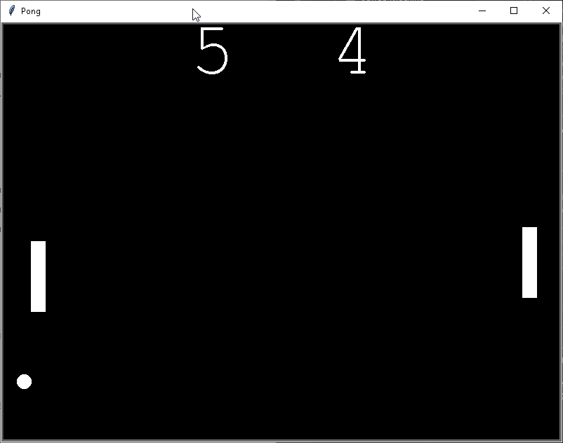

# 🏓 Pong Game 🏓

A simple yet fun implementation of the classic Pong game using Python's turtle module. Challenge a friend in a fast-paced, retro-style game where quick reflexes are key!

## 📜 Description

Pong is a two-player game where each player controls a paddle and tries to hit the ball back and forth. The objective is to score points by making your opponent miss the ball. The first player to reach 10 points wins the game!

### Key Features:
- **Classic Gameplay**: Faithful recreation of the original Pong mechanics.
- **Smooth Controls**: Responsive paddle movement using keyboard input.
- **Score Tracking**: Keeps track of each player's score and declares a winner.
- **Realistic Ball Physics**: The ball bounces off walls and paddles with accurate mechanics.
- **Adjustable Speed**: The ball gradually increases speed, making the game more challenging.

---
## 🚀 How to Play
1. **Control the paddles:**
   - **Player 1 (Left Paddle):**
     - 🆙 `W` - Move up
     - 🔽 `S` - Move down
   - **Player 2 (Right Paddle):**
     - 🆙 `Up Arrow` - Move up
     - 🔽 `Down Arrow` - Move down
2. **Hit the ball:**
   - The ball bounces off paddles and walls.
   - If a player misses the ball, the opponent scores a point.
3. **Win the game:**
   - The first player to reach **10 points** wins!

## ▶️ Running the Game

### Prerequisites
Make sure you have Python installed (Python 3.6 or higher).

### Clone the Repository

```sh
# Clone the repository
git clone https://github.com/Tsaousidis/Pong-Game.git

# Navigate to the project folder
cd Pong-Game
```

### Run the Game

```sh
# Run the game
python main.py
```
Enjoy playing Pong! 🏓

---

## 🎥 Demo


---

## 🔧 Technologies Used
- **Python** – Core programming language
- **Turtle Module** – Graphics and game rendering

## 🚀 Future Improvements
- **Multiplayer Mode Over Network** – Play against a friend online.
- **Difficulty Levels** – Adjustable AI difficulty for single-player mode.
- **Customizable Themes** – Change paddle and ball colors.

---

👨‍💻 Created by [Tsaousidis](https://github.com/Tsaousidis)  
🎉 Have fun playing! Let me know your thoughts and suggestions! 🎉

